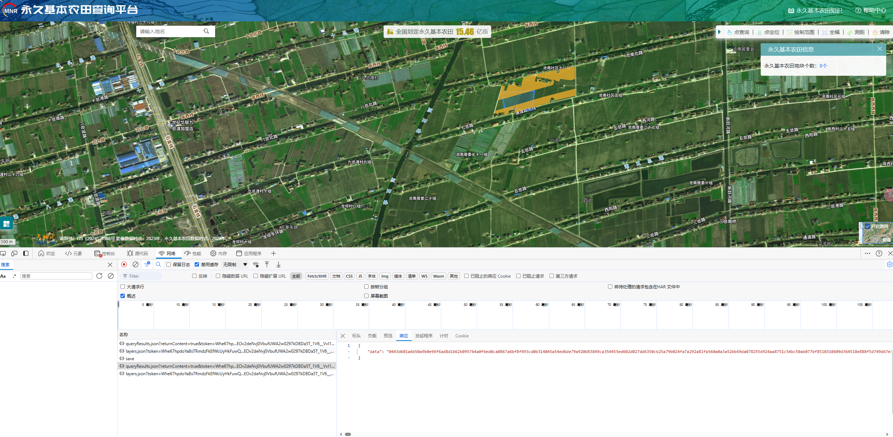
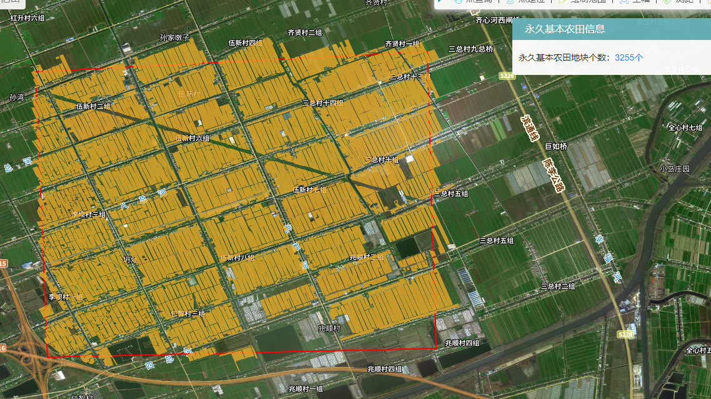
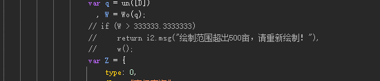
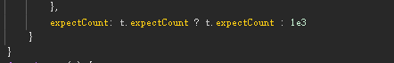
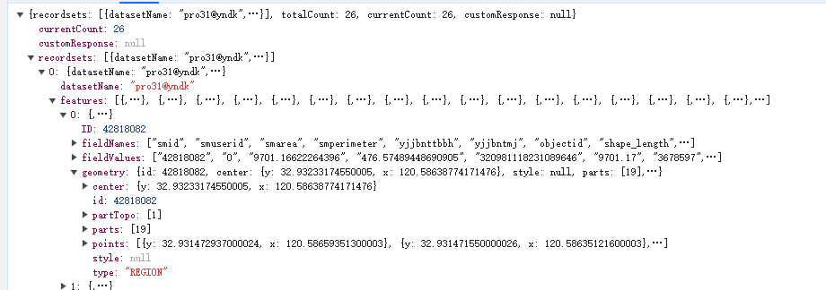
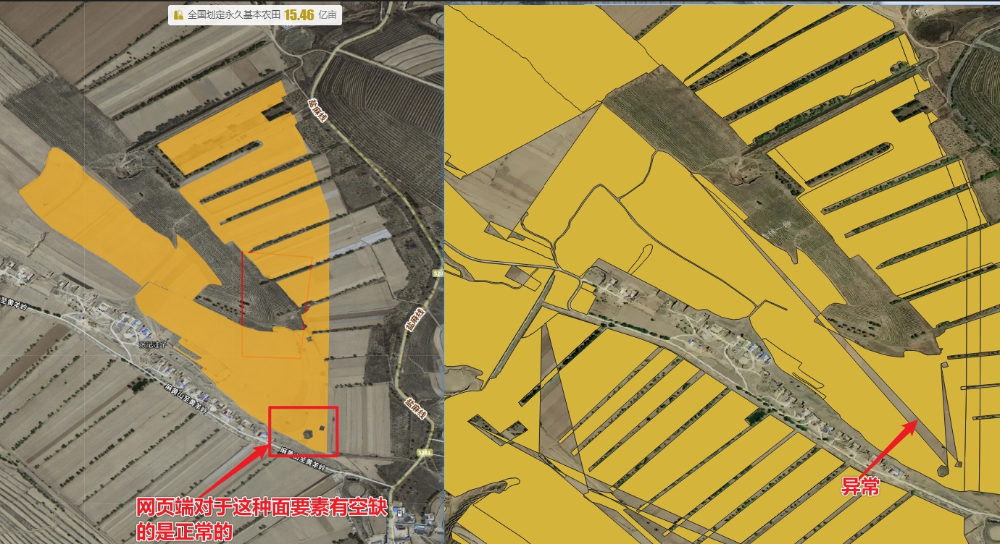
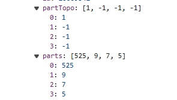
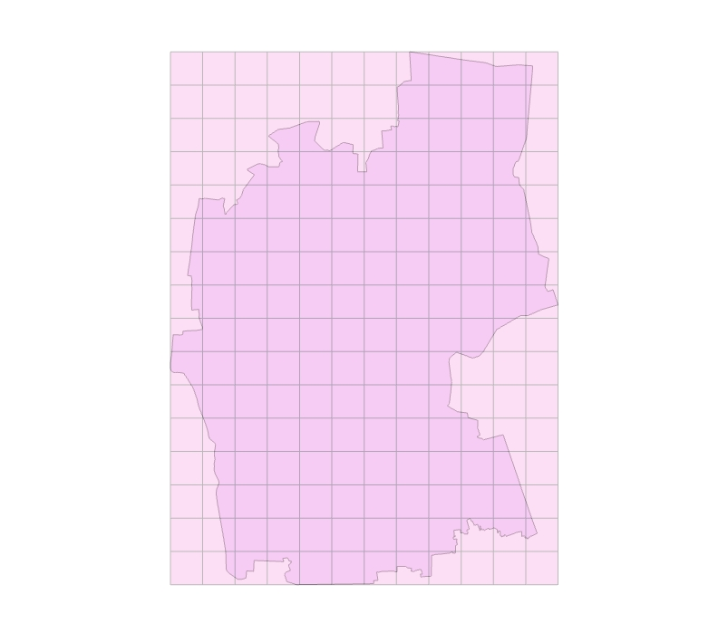

# 永久基本农田查询生成geojson数据


[永久基本农田查询平台](https://yncx.mnr.gov.cn/yn/#/home)


## 11-04更新

网站目前已经不在直接返回JSON数据了，查看网页使用了sm2加密，找到这个私钥直接进行模拟就可以了

请求数据中还增加了个token目前看来是个固定值




这里使用gmssl库来模拟sm2解密，传入请求的数据以及私钥

```
from gmssl import sm2
def decrypt_geojson(data,key):

    if data and data.startswith("04"):
        data = data[2:]
    sm2_crypt = sm2.CryptSM2(public_key="", private_key=key,mode=1)
    features = sm2_crypt.decrypt(bytes.fromhex(data))
    features=features.decode('utf-8')
    jsondata=json.loads(features)
    features=jsondata["recordsets"][0]["features"]

    return features

```


## 1、网页查询突破500亩限制
网站提供了点查询和范围查询，但是限制了500亩范围,直接上才艺



查看网页源文件发现这个限制实际是在前端进行验证的,找到这段代码直接注释掉



另外还有个1000个要素的限制，按需酌情修改，小心被ban



注意的是这里直接修改网页js是无法生效的，需要在替换文件夹中进行修改

## 2、PYTHON获取矢量数据

**从网页查询就能看出来这就是一个矢量叠加影像**

分析网络请求发现范围查询返回的是一个json数据，这里面就包含了所有要素的边界坐标，只要提取这个坐标信息就可以在GIS软件中还原出来了



### 2.1 矩形范围查找
使用网页的绘制范围绘制一个矩形范围进行查找，可以看到网页请求携带了这4个顶点坐标，服务器根据这4个顶点坐标生成了多边形然后在数据库查找返回

由于500亩的查询范围和1000片图斑的限制都是在前端验证的，这里使用脚本可以无需验证判断

#### 矩形范围查询的示例

**expectCount**：默认为1000，限制了最大查询图斑数量

**epsgCode**：默认为4490，坐标系为CGCS2000

**spatialQueryMode**：INTERSECT使用几何相交查询

**points**：在geometry对象中需要传入区域的顶点坐标，矩形直接使用两个顶点坐标即可

如果使用多边形多个顶点也是可以的，修改顶点个数即可，points属性中的id字段需要唯一生成

可以看到这里使用的是超图supermap

```
form_data = {
    'queryMode': 'SpatialQuery',
    'queryParameters': {
        'customParams': None,
        'prjCoordSys': {'epsgCode': 4490},
        'expectCount': n,
        'networkType': "LINE",
        'queryOption': "ATTRIBUTEANDGEOMETRY",
        'queryParams': [{'name': "pro31@yndk", 'attributeFilter': "1=1", 'fields': None}],
        'startRecord': 0,
        'holdTime': 10,
        'returnCustomResult': False,
        'returnFeatureWithFieldCaption': False
    },
    'geometry': {
        'id': 0,
        'style': None,
        'parts': [5],
        'points': [
            {'id': "SuperMap.Geometry_1", 'bounds': None, 'SRID': None, 'x': x1, 'y': y1, 'tag': None, 'type': "Point", 'geometryType': "Point"},
            {'id': "SuperMap.Geometry_2", 'bounds': None, 'SRID': None, 'x': x2, 'y': y1, 'tag': None, 'type': "Point", 'geometryType': "Point"},
            {'id': "SuperMap.Geometry_3", 'bounds': None, 'SRID': None, 'x': x2, 'y': y2, 'tag': None, 'type': "Point", 'geometryType': "Point"},
            {'id': "SuperMap.Geometry_4", 'bounds': None, 'SRID': None, 'x': x1, 'y': y2, 'tag': None, 'type': "Point", 'geometryType': "Point"},
            {'id': "SuperMap.Geometry_5", 'bounds': None, 'SRID': None, 'x': x1, 'y': y1, 'tag': None, 'type': "Point", 'geometryType': "Point"}
        ],
        'type': "REGION",
        'prjCoordSys': {'epsgCode': None}
    },
    'spatialQueryMode': "INTERSECT"
}
```
**运行示例**

````
if __name__ == "__main__":
    # 默认最大查询1000片，请酌情修改，查询太多可能会被ban，按需查询
    expectCount=1000
    # 保存文件路径
    file_path = 'yjnt2.geojson'
    # 默认按矩形查找，传入左上与右下坐标，建议查询范围不要太大，爱护服务器
    x1=121.333167
    y1=32.2544
    x2=121.33784
    y2=32.25190

    fetures=get_features(x1,y1,x2,y2,expectCount)
    download_geojson(file_path,fetures)

````


生成的geojson示例文件格式如下，可以直接导入gis软件生成矢量：
````
{
"type": "FeatureCollection",
"crs": { "type": "name", "properties": { "name": "urn:ogc:def:crs:EPSG::4490" } },
"features": [
{ "type": "Feature", "properties": { "ID": 42025373 }, "geometry": { "type": "Polygon", "coordinates": [ [ [ 120.705093603000023, 32.419247212000073 ], [ 120.704840518000083, 32.41916201600003 ], [ 120.70477883600006, 32.419255580000026 ], [ 120.70504355300011, 32.41934593700006 ], [ 120.705092870000044, 32.419260273000077 ], [ 120.705093603000023, 32.419247212000073 ] ] ] } },
{ "type": "Feature", "properties": { "ID": 42030018 }, "geometry": { "type": "Polygon", "coordinates": [ [ [ 120.705383644000108, 32.419345331000045 ], [ 120.705348222000111, 32.419333024000025 ], [ 120.705307874000027, 32.41941844400003 ], [ 120.705290340000033, 32.419430172000034 ], [ 120.705333192000012, 32.419444799000075 ], [ 120.705383644000108, 32.419345331000045 ] ] ] } },
{ "type": "Feature", "properties": { "ID": 42030233 }, "geometry": { "type": "Polygon", "coordinates": [ [ [ 120.706502662000048, 32.41991253100008 ], [ 120.706718018000061, 32.419743007000079 ], [ 120.706718267000042, 32.419743225000047 ], [ 120.706721468000069, 32.419746037000039 ], [ 120.706721885000093, 32.419745719000048 ], [ 120.706754322000052, 32.419721037000045 ], [ 120.706858322000016, 32.419827102000056 ], [ 120.706878926000059, 32.419847466000078 ], [ 120.706950813000049, 32.41978406800007 ], [ 120.707091414000047, 32.419631123000045 ], [ 120.707217812000067, 32.419506703000025 ], [ 120.707376698000076, 32.419365145000029 ], [ 120.707399784000017, 32.419344203000037 ], [ 120.707219529000099, 32.419283103000055 ], [ 120.707165961000101, 32.419263827000066 ], [ 120.706993972000078, 32.419212238000057 ], [ 120.706961270000079, 32.419202429000052 ], [ 120.70696458000009, 32.41919550800003 ], [ 120.706891193000047, 32.419172772000024 ], [ 120.706887928000015, 32.41918042900005 ], [ 120.706706068000017, 32.419125878000045 ], [ 120.706709660000115, 32.419116532000032 ], [ 120.706691743000079, 32.419110981000074 ], [ 120.706518804000098, 32.419057404000057 ], [ 120.706518281000058, 32.419057242000065 ], [ 120.706571668000038, 32.418937131000064 ], [ 120.706552710000096, 32.418930988000056 ], [ 120.706451224000034, 32.419151047000071 ], [ 120.706305504000056, 32.419491846000028 ], [ 120.706329230000051, 32.419491836000077 ], [ 120.706329873000072, 32.41949173900008 ], [ 120.706420367000078, 32.419477982000046 ], [ 120.706478108000056, 32.41945774900006 ], [ 120.706546562000085, 32.419416127000034 ], [ 120.706608089000042, 32.419373227000051 ], [ 120.706681838, 32.41930201200006 ], [ 120.706750613000054, 32.419238132000032 ], [ 120.706802711000023, 32.419202142000074 ], [ 120.706825503000118, 32.419195476000027 ], [ 120.706853457000079, 32.419200999000054 ], [ 120.706884082000101, 32.41922164500005 ], [ 120.706940366000026, 32.41926817500007 ], [ 120.706960085000105, 32.419294256000057 ], [ 120.706963911000116, 32.419334998000068 ], [ 120.706934475000025, 32.419405055000027 ], [ 120.706906091000064, 32.419456009000044 ], [ 120.706891419000044, 32.419476552000049 ], [ 120.706822924000107, 32.419530982000026 ], [ 120.706633886000077, 32.419658618000028 ], [ 120.706515810000042, 32.419735610000032 ], [ 120.706406180000045, 32.419802124000057 ], [ 120.706366025000079, 32.419819037000025 ], [ 120.706343248000053, 32.419820245000039 ], [ 120.706317772000034, 32.419814306000035 ], [ 120.706208785000058, 32.419767661000037 ], [ 120.706208270000047, 32.419767441000033 ], [ 120.706190085000117, 32.419762879000075 ], [ 120.706173960000115, 32.419800744000042 ], [ 120.706191253000043, 32.419807190000029 ], [ 120.70619178700008, 32.419807371000047 ], [ 120.706502662000048, 32.41991253100008 ] ] ] } },
{ "type": "Feature", "properties": { "ID": 42030615 }, "geometry": { "type": "Polygon", "coordinates": [ [ [ 120.70475009300003, 32.419245769000042 ], [ 120.704803026000036, 32.419149395000034 ], [ 120.704580951000025, 32.419074637000051 ], [ 120.704458063000061, 32.419034037000074 ], [ 120.704341199000055, 32.418994068000075 ], [ 120.704321636000032, 32.419032475000051 ], [ 120.704165036000063, 32.419354257000066 ], [ 120.704164905000084, 32.419354526000063 ], [ 120.704258741000103, 32.419387862000065 ], [ 120.704378140000017, 32.419436434000033 ], [ 120.704378267000038, 32.419436135000069 ], [ 120.70449330200006, 32.41916597900007 ], [ 120.7045225170001, 32.419175689000042 ], [ 120.704526057000066, 32.419169297000053 ], [ 120.704526537000106, 32.419169461000024 ], [ 120.70475009300003, 32.419245769000042 ] ] ] } },
{ "type": "Feature", "properties": { "ID": 42031511 }, "geometry": { "type": "Polygon", "coordinates": [ [ [ 120.705124238000053, 32.419257525000035 ], [ 120.705093603000023, 32.419247212000073 ], [ 120.705092870000044, 32.419260273000077 ], [ 120.70504355300011, 32.41934593700006 ], [ 120.705078595000032, 32.419357898000044 ], [ 120.705124238000053, 32.419257525000035 ] ] ] } },
{ "type": "Feature", "properties": { "ID": 42034186 }, "geometry": { "type": "Polygon", "coordinates": [ [ [ 120.704748065000103, 32.417127809000078 ], [ 120.704530099000067, 32.417055692000076 ], [ 120.704485675000114, 32.417230032000077 ], [ 120.704415253000093, 32.417408431000069 ], [ 120.704307275000019, 32.417583810000053 ], [ 120.704165913000111, 32.417880797000066 ], [ 120.70418307500006, 32.417887275000055 ], [ 120.704183562000026, 32.417887445000076 ], [ 120.704650187000084, 32.418049736000057 ], [ 120.705117301000087, 32.418212194000034 ], [ 120.705574998000088, 32.418380102000071 ], [ 120.705637780000075, 32.418402041000036 ], [ 120.705886355000075, 32.418488901000046 ], [ 120.705892211000105, 32.41847795800004 ], [ 120.706609520000029, 32.418720575000066 ], [ 120.706781805000105, 32.418320688000051 ], [ 120.706961983000042, 32.417902479000077 ], [ 120.706970731000069, 32.417882180000049 ], [ 120.706975420000049, 32.417871295000054 ], [ 120.706937584000116, 32.417858304000049 ], [ 120.706930137000086, 32.417875133000052 ], [ 120.705753636000054, 32.417474133000042 ], [ 120.705732521000073, 32.417519681000044 ], [ 120.705708107000078, 32.417572341000039 ], [ 120.705679939000106, 32.417633102000025 ], [ 120.705676109000024, 32.417641361000051 ], [ 120.705605720000108, 32.417793192000033 ], [ 120.705605592000097, 32.417793471000039 ], [ 120.705545700000016, 32.41777258500008 ], [ 120.705542144000106, 32.417781233000028 ], [ 120.705237717000045, 32.417683406000037 ], [ 120.705225849000044, 32.41767959200007 ], [ 120.705251781000015, 32.417712298000026 ], [ 120.705287852000083, 32.417767946000026 ], [ 120.705307449000088, 32.417830141000024 ], [ 120.705306064000069, 32.417875279000043 ], [ 120.70528859500007, 32.417918279000048 ], [ 120.705253768000034, 32.417971737000073 ], [ 120.70523641300008, 32.417979882000054 ], [ 120.705212891000087, 32.417981927000028 ], [ 120.70514976100003, 32.417984928000067 ], [ 120.705121295000026, 32.417985911000073 ], [ 120.705094097000028, 32.417976400000043 ], [ 120.70503979800003, 32.417928399000061 ], [ 120.704940819000058, 32.41784397300006 ], [ 120.704854437000108, 32.41776797700004 ], [ 120.704735918000097, 32.417679514000042 ], [ 120.70462085500003, 32.417594419000068 ], [ 120.704555590000041, 32.417542043000026 ], [ 120.704538002000049, 32.417450526000039 ], [ 120.704571286000032, 32.417390216000058 ], [ 120.704665198000043, 32.41730709400008 ], [ 120.704748065000103, 32.417127809000078 ] ] ] } },
{ "type": "Feature", "properties": { "ID": 42034708 }, "geometry": { "type": "Polygon", "coordinates": [ [ [ 120.709031671000048, 32.419561434000059 ], [ 120.708355728000015, 32.419323015000032 ], [ 120.708192303000033, 32.419263640000054 ], [ 120.707748975000072, 32.419111649000058 ], [ 120.7075860220001, 32.419058358000029 ], [ 120.706660311000064, 32.418739165000034 ], [ 120.707022356000039, 32.417912337000075 ], [ 120.707021854000118, 32.41791216300004 ], [ 120.706999114000041, 32.417903810000041 ], [ 120.706816960000083, 32.418329973000027 ], [ 120.706634803000043, 32.418756134000034 ], [ 120.70665081900006, 32.418764456000076 ], [ 120.706898217000116, 32.418849198000032 ], [ 120.707305552000093, 32.418998242000043 ], [ 120.707874496000045, 32.419182600000056 ], [ 120.70840738000004, 32.419367158000057 ], [ 120.709027988000116, 32.419569753000076 ], [ 120.709031536000111, 32.419561743000031 ], [ 120.709031671000048, 32.419561434000059 ] ] ] } },
{ "type": "Feature", "properties": { "ID": 42034831 }, "geometry": { "type": "Polygon", "coordinates": [ [ [ 120.704840518000083, 32.41916201600003 ], [ 120.704803026000036, 32.419149395000034 ], [ 120.70475009300003, 32.419245769000042 ], [ 120.70477883600006, 32.419255580000026 ], [ 120.704840518000083, 32.41916201600003 ] ] ] } },
{ "type": "Feature", "properties": { "ID": 42035651 }, "geometry": { "type": "Polygon", "coordinates": [ [ [ 120.705822774000012, 32.419648083000027 ], [ 120.705892845000108, 32.419522244000063 ], [ 120.705383644000108, 32.419345331000045 ], [ 120.705333192000012, 32.419444799000075 ], [ 120.705369668000117, 32.41945725000005 ], [ 120.705271702000118, 32.419742982000059 ], [ 120.705399778000015, 32.419787377000034 ], [ 120.70539989800011, 32.419787088000078 ], [ 120.705472382000039, 32.419612442000073 ], [ 120.705472530000065, 32.419612492000056 ], [ 120.705472907000058, 32.419612621000056 ], [ 120.705659070000024, 32.419675915000028 ], [ 120.705659222, 32.419675638000058 ], [ 120.70569988200009, 32.419601319000037 ], [ 120.705822272000091, 32.419647908000059 ], [ 120.705822774000012, 32.419648083000027 ] ] ] } },
{ "type": "Feature", "properties": { "ID": 42037177 }, "geometry": { "type": "Polygon", "coordinates": [ [ [ 120.704341199000055, 32.418994068000075 ], [ 120.704458063000061, 32.419034037000074 ], [ 120.704580951000025, 32.419074637000051 ], [ 120.704803026000036, 32.419149395000034 ], [ 120.704840518000083, 32.41916201600003 ], [ 120.705093603000023, 32.419247212000073 ], [ 120.705124238000053, 32.419257525000035 ], [ 120.705339047000052, 32.419329837000078 ], [ 120.705348222000111, 32.419333024000025 ], [ 120.705383644000108, 32.419345331000045 ], [ 120.705892845000108, 32.419522244000063 ], [ 120.705923436000035, 32.419532872000048 ], [ 120.706206122000026, 32.419631085000049 ], [ 120.706210970000029, 32.419619496000053 ], [ 120.705590567000058, 32.419405414000039 ], [ 120.704970168000045, 32.419191329000057 ], [ 120.704349770000022, 32.41897724100005 ], [ 120.704341199000055, 32.418994068000075 ] ] ] } },
{ "type": "Feature", "properties": { "ID": 42037791 }, "geometry": { "type": "Polygon", "coordinates": [ [ [ 120.707022356000039, 32.417912337000075 ], [ 120.706660311000064, 32.418739165000034 ], [ 120.7075860220001, 32.419058358000029 ], [ 120.707748975000072, 32.419111649000058 ], [ 120.708192303000033, 32.419263640000054 ], [ 120.708355728000015, 32.419323015000032 ], [ 120.709031671000048, 32.419561434000059 ], [ 120.709211628000048, 32.419147018000047 ], [ 120.709391718, 32.418732292000072 ], [ 120.708799248000105, 32.418527264000033 ], [ 120.708206780000069, 32.418322233000026 ], [ 120.707614316000104, 32.41811720000004 ], [ 120.707022356000039, 32.417912337000075 ] ] ] } },
{ "type": "Feature", "properties": { "ID": 42041119 }, "geometry": { "type": "Polygon", "coordinates": [ [ [ 120.706365395000034, 32.419267350000041 ], [ 120.706590184000106, 32.418765119000057 ], [ 120.706392157000096, 32.418695873000047 ], [ 120.706391643000075, 32.418695693000075 ], [ 120.706305035000014, 32.418906541000069 ], [ 120.706304913000054, 32.418906838000055 ], [ 120.706290946000081, 32.418901884000036 ], [ 120.706290616000047, 32.41890271300008 ], [ 120.705985744000031, 32.418814747000056 ], [ 120.705993629000091, 32.418796436000036 ], [ 120.705610661000037, 32.418660609000028 ], [ 120.705621199, 32.41862851500008 ], [ 120.705620047000025, 32.418628162000061 ], [ 120.705513137000025, 32.418868810000049 ], [ 120.705501992000109, 32.418886478000047 ], [ 120.705473194000092, 32.418912653000064 ], [ 120.705467249000094, 32.418913682000039 ], [ 120.705451645000039, 32.418916384000056 ], [ 120.70544165900003, 32.418916032000027 ], [ 120.705406848000052, 32.418914807000078 ], [ 120.705220355000051, 32.418871746000036 ], [ 120.705070015000047, 32.418824572000062 ], [ 120.704988929000024, 32.41879351700004 ], [ 120.704926419000117, 32.418758517000072 ], [ 120.704892125000015, 32.418724424000061 ], [ 120.704884761000017, 32.418705510000052 ], [ 120.704880981000088, 32.418625921000057 ], [ 120.704880465000087, 32.418615076000037 ], [ 120.704880364000019, 32.418612907000067 ], [ 120.704885048000051, 32.418599952000079 ], [ 120.704919583000105, 32.418504451000047 ], [ 120.704974244000027, 32.418367267000065 ], [ 120.705010642000047, 32.418288619000066 ], [ 120.705026297000018, 32.418270390000032 ], [ 120.705047888000081, 32.418253013000026 ], [ 120.705066686, 32.418240396000044 ], [ 120.704616304000069, 32.418083757000034 ], [ 120.704166412000063, 32.417927284000029 ], [ 120.704165925000098, 32.417927115000055 ], [ 120.704148136000072, 32.417922339000029 ], [ 120.703971259000014, 32.418335715000069 ], [ 120.703794382000069, 32.418749090000063 ], [ 120.703806625000084, 32.418752932000075 ], [ 120.704237221000085, 32.418896265000058 ], [ 120.704667818000075, 32.419039597000051 ], [ 120.704674739000097, 32.419041913000058 ], [ 120.704679664000082, 32.419043613000042 ], [ 120.705195841000091, 32.419221850000042 ], [ 120.705712020000078, 32.419400083000028 ], [ 120.706228200000055, 32.419578315000024 ], [ 120.706228331000034, 32.419578019000028 ], [ 120.706356518, 32.419287186000076 ], [ 120.706360664000044, 32.41927792000007 ], [ 120.706365395000034, 32.419267350000041 ] ] ] } },
{ "type": "Feature", "properties": { "ID": 42041505 }, "geometry": { "type": "Polygon", "coordinates": [ [ [ 120.705348222000111, 32.419333024000025 ], [ 120.705339047000052, 32.419329837000078 ], [ 120.705124238000053, 32.419257525000035 ], [ 120.705078595000032, 32.419357898000044 ], [ 120.705290340000033, 32.419430172000034 ], [ 120.705307874000027, 32.41941844400003 ], [ 120.705348222000111, 32.419333024000025 ] ] ] } },
{ "type": "Feature", "properties": { "ID": 42043082 }, "geometry": { "type": "Polygon", "coordinates": [ [ [ 120.706609520000029, 32.418720575000066 ], [ 120.705892211000105, 32.41847795800004 ], [ 120.705886355000075, 32.418488901000046 ], [ 120.705988716000093, 32.418524668000032 ], [ 120.706020107000086, 32.418535636000058 ], [ 120.706402435000086, 32.41866923200007 ], [ 120.706601625000076, 32.418738897000026 ], [ 120.706609520000029, 32.418720575000066 ] ] ] } }
]
}

````

#### 成果展示

直接在GIS软件中加载，可以叠加谷歌影像等查看，能够缩放到更高的比例


#### 10-11更新
感谢[salierib](https://github.com/salierib)的提醒，原先生成的geojson没有考虑面要素内部孔洞的问题



获取到的json数据中partTopo和parts对象区分了外部和内部顶点



这里修改判断是否存在孔洞使用polygon的holes传参

```
for part in parts:
    end_index = start_index + part
    ring = [(points[i]['x'], points[i]['y']) for i in range(start_index, end_index)]

    if not exterior_ring:  # 如果外部边界尚未设置，则这是外部边界
        exterior_ring = ring
    else:  # 否则，这是一个内部边界
        interior_rings.append(ring)
    start_index = end_index

# 如果没有内部边界，Polygon 只需要外部边界
if not interior_rings:
    polygon = Polygon(exterior_ring)
else:
# 创建Polygon对象，第一个参数是外部边界，第二个参数是一个内部边界的列表
    polygon = Polygon(exterior_ring, holes=interior_rings)
```
### 2.2多边形查询

由于网页端设置了500亩和1000片的查询限制，我们直接突破限制查询可能会带来不必要的麻烦

建议还是按照网页端查询的规则来，模拟更真实的请求

另外网页端对每天的查询次数，每个IP的查询次数都是有限制的，虽然都是在前端完成的

但是这些措施都是为了防止请多过多、数据量过大给服务器带来压力

按照500亩的范围来查询，想要获得一个较大的区域如何来实现呢

你可能已经想到了，直接切割为更小的单元来进行

- 获取给定多边形的最大坐标边界，计算出宽和高，按照最小的粒度计算需要切割的瓦片数（500亩大概是577*577的网格）

- 计算出每个瓦片对应的度数

- 根据行列号遍历获取每个网格顶点坐标，使用2.1的矩形下载



#### 示例代码

这里通过读取geojson文件的几何来获取多边形的边界

```
if __name__ == '__main__':
    # 读取GeoJSON文件，获取第一个多边形，多个自行遍历
    file_path = 'example.geojson'
    gdf = gpd.read_file(file_path)
    polygon = gdf.geometry.iloc[0]

    # 定义栅格大小,限制面积500亩,这里设置为500*500米
    grid_size = 500

    # 设置保存路径
    savefile_path = 'download_example.geojson'

    #下载栅格
    failure_grids=download_by_girds(polygon, grid_size, savefile_path)

    #保存下载失败栅格坐标，后续可以直接使用矩形查找增加
    with open('failure_girds', 'w') as file:
        json.dump(failure_grids, file)

```
#### 成果展示

完整的下载后可以按需裁剪为范围内


## 免责声明
 
本爬虫脚本仅用于个人学习和研究目的。使用者应遵守当地法律法规，尊重网站的使用规定，并对使用本脚本所产生的任何法律责任自行承担。作者不对因滥用本脚本而产生的任何后果负责。
使用本脚本即代表您同意以上免责申明。